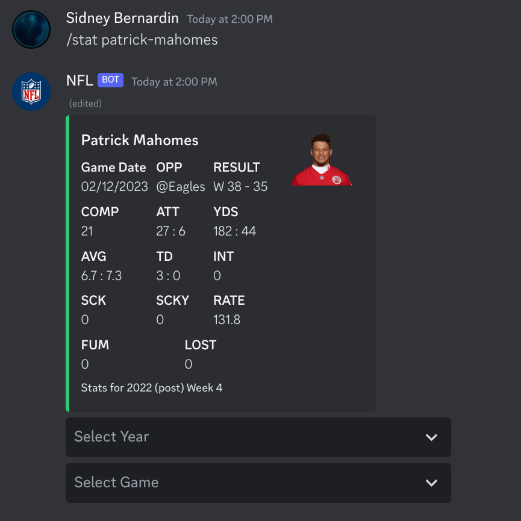
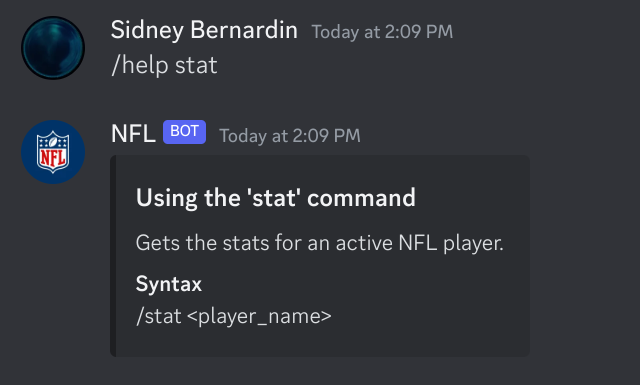

[](https://github.com/Sidney-Bernardin/NFL-Discord-Bot/actions/workflows/unit_tests.yaml)

# NFL-Discord-Bot

**Contents**
1. [Overview](#overview)
1. [Usage](#usage)

## Overview
This is a discord bot that lets users look up current stats for NFL players by web-scraping nfl.com.

For more on how this project works, visit my [portfolio](https://sidney-bernardin.github.io/project/?id=nfl_discord_bot).

## Usage

### Install and run

Clone this repository and set the following environment variables.
``` bash
git clone https://github.com/Sidney-Bernardin/NFL-Discord-Bot.git
cd NFL-Discord-Bot

export TOKEN=your_token_here
export PREFIX=/
```
Then run directly on your machine or with Docker.

#### Run directly on your machine.
``` bash
python main.py
```

#### Run with Docker.
``` bash
docker build -t nfl_discord_bot .
docker run -it \
    -e PREFIX=/ \
    -e TOKEN=your_token_here \
    -v ./logs/:/app/logs \
    nfl_discord_bot
```

### Commands

#### Stat
Lets users select stats of a game/year from an active NFL player's career.
<div align=left>
  
</div>

#### Help
Gives users instructions for using the bot.
<div align=left>
  
</div>
